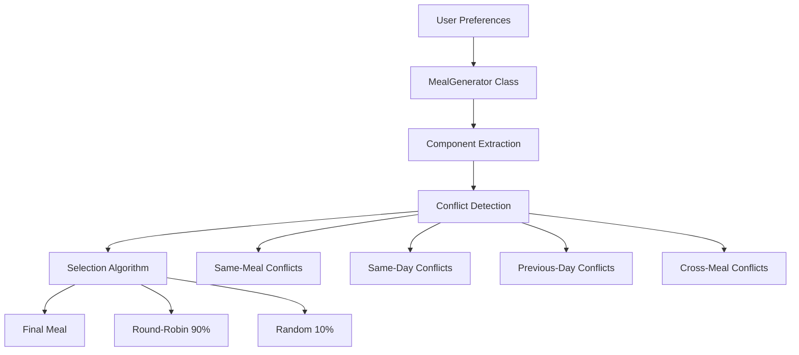
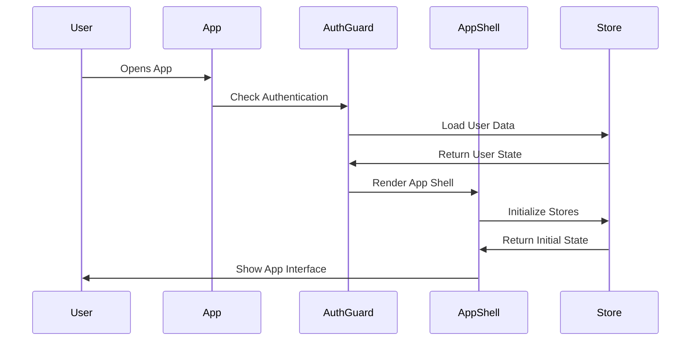
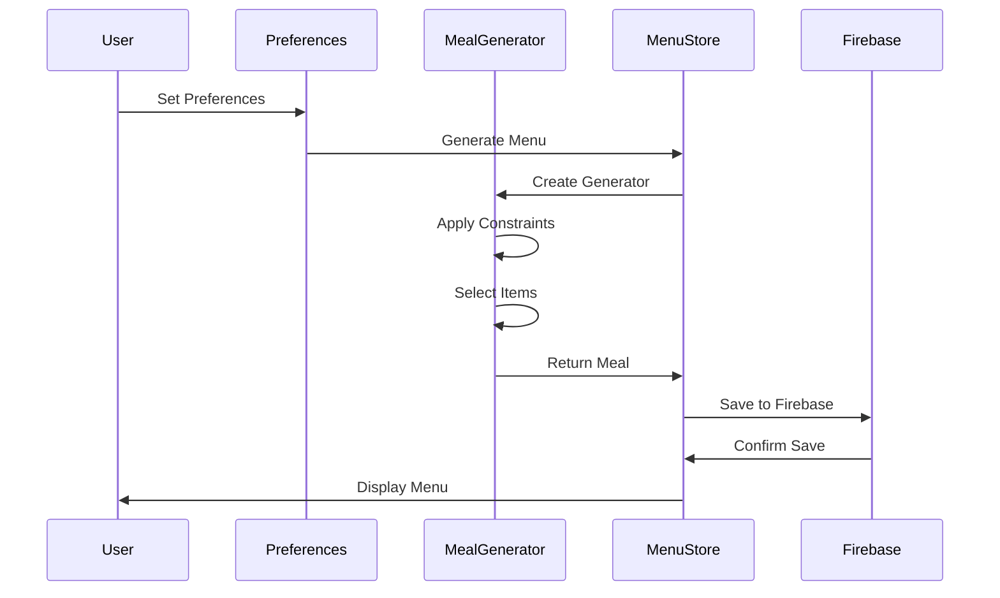
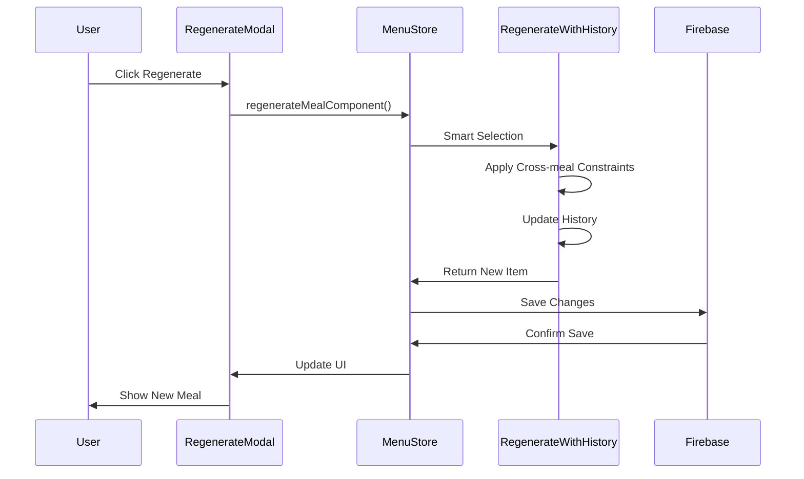

# Meal Planner - Developer Documentation

## 📋 Table of Contents
1. [Project Overview](#project-overview)
2. [Architecture & Tech Stack](#architecture--tech-stack)
3. [File Structure & Responsibilities](#file-structure--responsibilities)
4. [Core Algorithms](#core-algorithms)
5. [Code Flow & Execution Order](#code-flow--execution-order)
6. [State Management](#state-management)
7. [Key Features Implementation](#key-features-implementation)
8. [Database Schema](#database-schema)
9. [API Endpoints](#api-endpoints)
10. [Development Guidelines](#development-guidelines)

---

## 🎯 Project Overview

**Meal Planner** is a React-based web application that generates personalized weekly meal plans based on user preferences. The app uses advanced algorithms to ensure meal variety, prevent component conflicts, and provide a seamless user experience.

### Key Features
- **Smart Meal Generation**: Component-based conflict detection
- **Cross-meal Constraints**: Prevents repetition across consecutive meals
- **Individual Meal Regeneration**: Granular control over specific meals
- **Real-time Notifications**: Capacitor-based mobile notifications
- **PDF Generation**: Downloadable weekly meal plans
- **Responsive Design**: Mobile-first approach with Tailwind CSS

---

## 🏗️ Architecture & Tech Stack

### Frontend Stack
```
React 18 + TypeScript
├── Vite (Build Tool)
├── React Router (Navigation)
├── Zustand (State Management)
├── Tailwind CSS (Styling)
├── Lucide React (Icons)
└── Capacitor (Mobile Integration)
```

### Backend Services
```
Firebase
├── Firestore (Database)
├── Authentication
└── Hosting
```

### Mobile Integration
```
Capacitor
├── Local Notifications
├── App Icons & Splash
└── Android Build
```

---

## 📁 File Structure & Responsibilities

### Root Level
```
meal_planner/
├── src/
│   ├── components/          # Reusable UI components
│   ├── pages/              # Route-based page components
│   ├── store/              # Zustand state management
│   ├── services/           # External service integrations
│   ├── utils/              # Utility functions
│   └── config/             # Configuration files
├── public/                 # Static assets
├── android/               # Android build files
└── dist/                   # Production build
```

### Core Directories

#### `/src/components/`
| File | Purpose |
|------|---------|
| `AppShell.tsx` | Main layout wrapper with navigation |
| `AuthGuard.tsx` | Authentication protection wrapper |
| `RegenerateModal.tsx` | Modal for individual meal regeneration |
| `NutritionDisplay.tsx` | Nutrition information display component |

#### `/src/pages/`
| Directory | Purpose |
|-----------|---------|
| `Home.tsx` | Landing page with menu overview |
| `menu/` | Menu display pages (Daily/Weekly views) |
| `preferences/` | User preference configuration |
| `Profile.tsx` | User profile and settings |

#### `/src/store/`
| File | Purpose |
|------|---------|
| `auth.ts` | User authentication state |
| `menu.ts` | Meal generation and management |
| `preferences.ts` | User food preferences |
| `notifications.ts` | Notification scheduling |

#### `/src/services/`
| File | Purpose |
|------|---------|
| `firebaseService.ts` | Firebase integration layer |
| `firebase.ts` | Firebase configuration |

#### `/src/utils/`
| File | Purpose |
|------|---------|
| `nutrition.ts` | Nutrition data and calculations |
| `pdfGenerator.ts` | PDF generation for meal plans |
| `errorMessages.ts` | Error message constants |

---

## 🧠 Core Algorithms

### 1. Meal Generation Algorithm

The meal generation uses a sophisticated multi-layered approach:



#### Component-Based Conflict Detection
```typescript
// Component extraction from dish names
function extractComponents(dishName: string): string[] {
    const componentMap = {
        'aloo': ['aloo', 'potato'],
        'baingan': ['baingan', 'brinjal', 'eggplant'],
        'cabbage': ['cabbage'],
        // ... more components
    };
    // Returns array of component keys
}
```

#### Conflict Hierarchy (Priority Order)
1. **Same-Meal Conflicts** (Highest Priority)
   - No duplicate components within the same meal
2. **Same-Day Conflicts**
   - No duplicate components within the same day
3. **Previous Day Conflicts**
   - No duplicate components from previous days
4. **Cross-Meal Conflicts** (New Feature)
   - Lunch avoids yesterday's dinner components
   - Dinner avoids yesterday's lunch components
5. **Regeneration History**
   - Avoids last 3 regenerated items (session-based)


### 2. Regeneration History Algorithm

```typescript
// Session-based history tracking
const historyKey = `regeneration_history_${componentType}`;
const history = JSON.parse(localStorage.getItem(historyKey) || '[]');

// Smart selection with 70% random, 30% systematic
if (Math.random() < 0.7) {
    selectedItem = finalItems[Math.floor(Math.random() * finalItems.length)];
} else {
    const systematicIndex = (dayIndex + (mealType === 'lunch' ? 0 : 1)) % finalItems.length;
    selectedItem = finalItems[systematicIndex];
}
```

---

## 🔄 Code Flow & Execution Order

### Application Startup Flow



### Meal Generation Flow



### Individual Meal Regeneration Flow



---

## 🗃️ State Management

### Zustand Store Architecture

#### 1. Authentication Store (`auth.ts`)
```typescript
interface AuthState {
    user: User | null;
    loading: boolean;
    signIn: (email: string, password: string) => Promise<void>;
    signUp: (email: string, password: string, name: string) => Promise<void>;
    signOut: () => Promise<void>;
}
```

#### 2. Menu Store (`menu.ts`)
```typescript
interface MenuState {
    week: WeekMenu;
    loading: boolean;
    regeneratingMeal: string | null;
    showRegenerateModal: boolean;
    generate: (prefs: Preferences) => Promise<void>;
    regenerateMealComponent: (dayIndex, mealType, component, prefs) => Promise<void>;
    regenerateWithHistory: (componentType, currentItem, availableItems, dayIndex, mealType) => string;
}
```

#### 3. Preferences Store (`preferences.ts`)
```typescript
interface PreferencesState {
    selected: Preferences;
    loading: boolean;
    savePreferences: (prefs: Preferences) => Promise<void>;
    loadPreferences: () => Promise<void>;
}
```

#### 4. Notifications Store (`notifications.ts`)
```typescript
interface NotificationState {
    notificationTime: string;
    isEnabled: boolean;
    setNotificationTime: (time: string) => Promise<void>;
    scheduleNotification: (menu: WeekMenu) => Promise<void>;
}
```

---

## 🔧 Key Features Implementation

### 1. Smart Meal Generation

**File**: `src/store/menu.ts`

**Algorithm**:
1. Extract components from dish names
2. Apply conflict detection hierarchy
3. Use round-robin (90%) + random (10%) selection
4. Maintain regeneration history

**Key Methods**:
- `extractComponents()`: Parse dish names into components
- `sharesComponentsWithAny()`: Check for component conflicts
- `findNonConflictingDish()`: Select items avoiding conflicts
- `hasCrossMealConflict()`: Check cross-meal constraints

### 2. Individual Meal Regeneration

**File**: `src/components/RegenerateModal.tsx`

**Features**:
- Modal-based regeneration interface
- Component-specific regeneration (dal/veg/both)
- Real-time loading states
- Session-based history tracking

**Key Methods**:
- `handleRegenerate()`: Process regeneration requests
- `regenerateWithHistory()`: Smart selection with history
- `updateRegenerationHistory()`: Maintain session history

### 3. Cross-Meal Constraint System

**Implementation**:
```typescript
// Check cross-meal conflicts
private hasCrossMealConflict(dish: string, previousMeals: Meal[], currentMealType: 'lunch' | 'dinner'): boolean {
    if (currentMealType === 'lunch') {
        // Avoid yesterday's dinner components
        const yesterdayDinnerDal = yesterdayMeal.dinner[0];
        const yesterdayDinnerVeg = yesterdayMeal.dinner[1];
        return sharesComponentsWithAny(dish, [yesterdayDinnerDal, yesterdayDinnerVeg], false);
    } else if (currentMealType === 'dinner') {
        // Avoid yesterday's lunch components
        const yesterdayLunchDal = yesterdayMeal.lunch[0];
        const yesterdayLunchVeg = yesterdayMeal.lunch[1];
        return sharesComponentsWithAny(dish, [yesterdayLunchDal, yesterdayLunchVeg], false);
    }
}
```

### 4. Notification System

**File**: `src/store/notifications.ts`

**Features**:
- Capacitor-based local notifications
- Time-based scheduling
- Context-aware messages
- Cross-platform support

**Key Methods**:
- `scheduleNotification()`: Schedule daily notifications
- `getNotificationMessage()`: Generate context-aware messages
- `clearNotifications()`: Cancel existing notifications

### 5. PDF Generation

**File**: `src/utils/pdfGenerator.ts`

**Features**:
- Weekly meal plan PDFs
- Nutrition information
- Custom styling
- Download functionality

---

## 🗄️ Database Schema

### Firestore Collections

#### Users Collection
```typescript
interface UserDocument {
    id: string;
    name: string;
    email: string;
    preferences: Preferences;
    menu: WeekMenu;
    notificationTime: string;
    feedback: Feedback[];
}
```

#### Preferences Structure
```typescript
interface Preferences {
    breakfast: string[];
    dal: string[];
    curry: string[];
    veg: string[];
}
```

#### Menu Structure
```typescript
interface WeekMenu {
    [index: number]: {
        breakfast: string;
        lunch: [string, string, string]; // [dal, veg, roti/rice]
        dinner: [string, string, string]; // [dal, veg, roti/rice]
    };
}
```

---

## 🌐 API Endpoints

### Firebase Service Methods

**File**: `src/services/firebaseService.ts`

```typescript
// User Management
export const createUser = (userData: UserData): Promise<ServiceResponse<UserData>>;
export const updateUser = (userId: string, userData: Partial<UserData>): Promise<ServiceResponse<void>>;
export const getUser = (userId: string): Promise<ServiceResponse<UserData>>;

// Menu Management
export const updateUserMenu = (userId: string, menu: WeekMenu): Promise<ServiceResponse<void>>;
export const clearUserMenu = (userId: string): Promise<ServiceResponse<void>>;

// Preferences Management
export const saveUserPreferences = (userId: string, preferences: Preferences): Promise<ServiceResponse<void>>;
export const loadUserPreferences = (userId: string): Promise<ServiceResponse<Preferences>>;

// Feedback Management
export const saveFeedback = (userId: string, feedback: Feedback): Promise<ServiceResponse<void>>;
export const getUserFeedback = (userId: string): Promise<ServiceResponse<Feedback[]>>;
```

---

## 🚀 Development Guidelines

### Code Organization Principles

1. **Single Responsibility**: Each file has one clear purpose
2. **Separation of Concerns**: UI, logic, and data layers are separate
3. **Type Safety**: Full TypeScript coverage
4. **State Management**: Centralized with Zustand
5. **Error Handling**: Comprehensive error boundaries

### Key Development Patterns

#### 1. Component Structure
```typescript
// Standard component pattern
export function ComponentName() {
    // 1. Hooks and state
    const { data } = useStore();
    
    // 2. Event handlers
    const handleAction = () => {};
    
    // 3. Effects
    useEffect(() => {}, []);
    
    // 4. Render
    return <div>Content</div>;
}
```

#### 2. Store Pattern
```typescript
// Zustand store pattern
export const useStore = create<StoreState>((set, get) => ({
    // State
    data: null,
    
    // Actions
    action: async () => {
        set({ loading: true });
        try {
            const result = await apiCall();
            set({ data: result, loading: false });
        } catch (error) {
            set({ error, loading: false });
        }
    }
}));
```

#### 3. Error Handling Pattern
```typescript
// Consistent error handling
try {
    const result = await operation();
    return { data: result, error: null };
} catch (error) {
    console.error('Operation failed:', error);
    return { data: null, error: error.message };
}
```

### Testing Strategy

1. **Unit Tests**: Individual function testing
2. **Integration Tests**: Store and component interaction
3. **E2E Tests**: Full user workflow testing
4. **Performance Tests**: Algorithm efficiency testing

### Performance Considerations

1. **Lazy Loading**: Route-based code splitting
2. **Memoization**: React.memo for expensive components
3. **State Optimization**: Minimal re-renders
4. **Algorithm Efficiency**: O(n) complexity for meal generation

---

## 🔧 Build & Deployment

### Development Commands
```bash
# Install dependencies
npm install

# Start development server
npm run dev

# Build for production
npm run build

# Preview production build
npm run preview
```

### Mobile Build Commands
```bash
# Sync with Capacitor
npx cap sync android

# Build Android APK
npx cap build android

# Open in Android Studio
npx cap open android
```

### Environment Variables
```env
VITE_FIREBASE_API_KEY=your_api_key
VITE_FIREBASE_AUTH_DOMAIN=your_domain
VITE_FIREBASE_PROJECT_ID=your_project_id
```

---

## 📚 Key Learning Points

### After 6 Months - Quick Refresh

1. **Start Here**: `src/App.tsx` → `src/components/AppShell.tsx`
2. **Core Logic**: `src/store/menu.ts` (MealGenerator class)
3. **UI Components**: `src/pages/menu/` for meal display
4. **State Flow**: Zustand stores in `src/store/`
5. **External Services**: `src/services/firebaseService.ts`

### Critical Files to Understand
- `src/store/menu.ts`: Core meal generation algorithm
- `src/components/RegenerateModal.tsx`: Individual meal regeneration
- `src/services/firebaseService.ts`: Data persistence layer
- `src/store/notifications.ts`: Mobile notification system

### Algorithm Complexity
- **Meal Generation**: O(n²) where n = number of preferences
- **Conflict Detection**: O(m) where m = number of components
- **Cross-meal Constraints**: O(1) constant time lookup

---

## 🐛 Common Issues & Solutions

### 1. Cross-Meal Constraint Not Working
**Issue**: Same components appearing in consecutive meals
**Solution**: Check `hasCrossMealConflict()` method in `menu.ts`

### 2. Regeneration History Persisting
**Issue**: History not clearing between sessions
**Solution**: Check `clearRegenerationHistory()` in `AppShell.tsx`

### 3. Notification Not Showing
**Issue**: Capacitor notifications not working
**Solution**: Check permissions and `scheduleNotification()` method

### 4. PDF Generation Failing
**Issue**: PDF not generating or downloading
**Solution**: Check `generateMenuPDF()` in `pdfGenerator.ts`

---

## 📈 Future Enhancements

### Planned Features
1. **Nutrition Analytics**: Detailed nutrition tracking
2. **Meal Rating System**: User feedback on generated meals
3. **Shopping List Generation**: Automatic ingredient lists
4. **Social Sharing**: Share meal plans with family
5. **AI-Powered Suggestions**: Machine learning recommendations

### Technical Improvements
1. **Performance Optimization**: Algorithm efficiency improvements
2. **Offline Support**: PWA capabilities
3. **Advanced Notifications**: Rich notification content
4. **Analytics Integration**: User behavior tracking
5. **A/B Testing**: Feature experimentation framework

---

*Last Updated: December 2024*
*Version: 1.0.0*
*Maintainer: Development Team*
